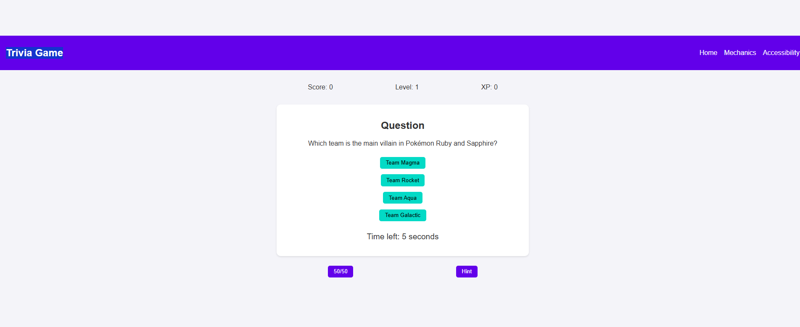
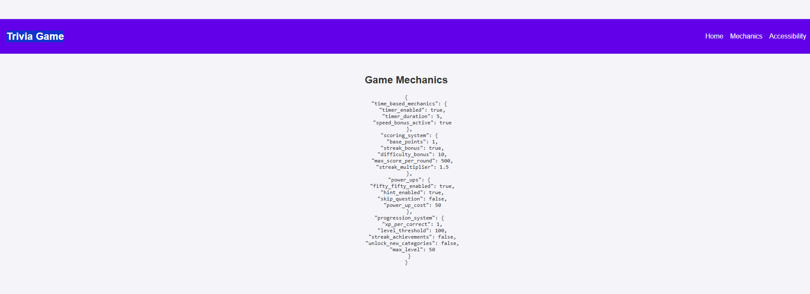
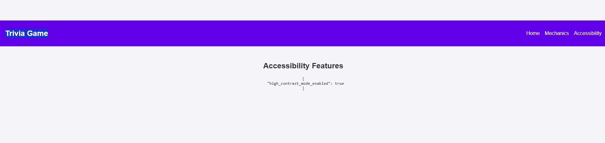
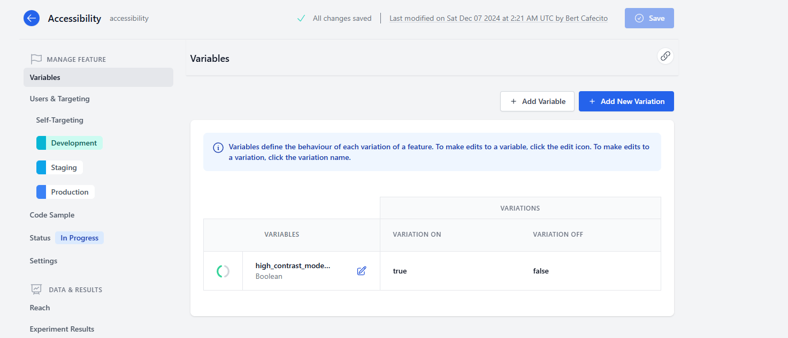
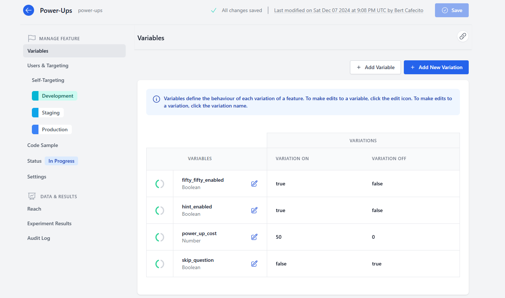
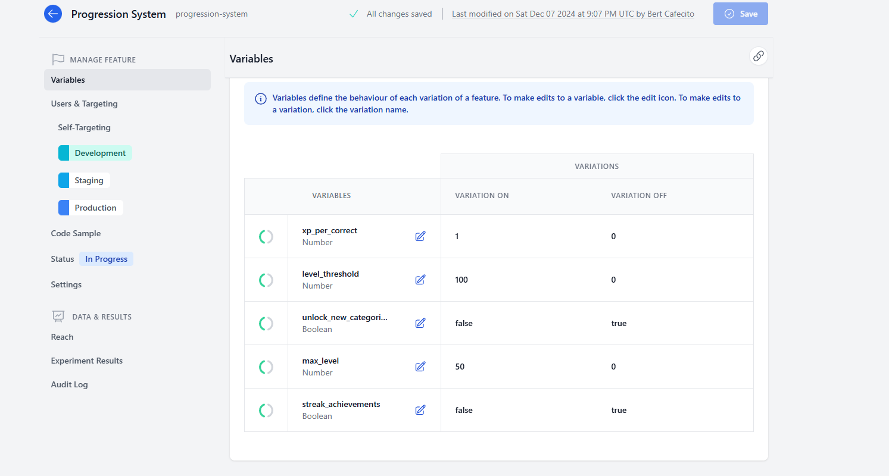
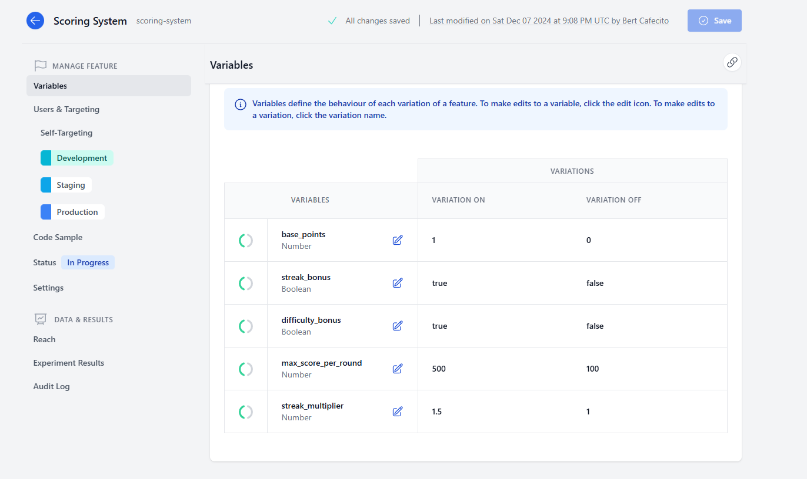
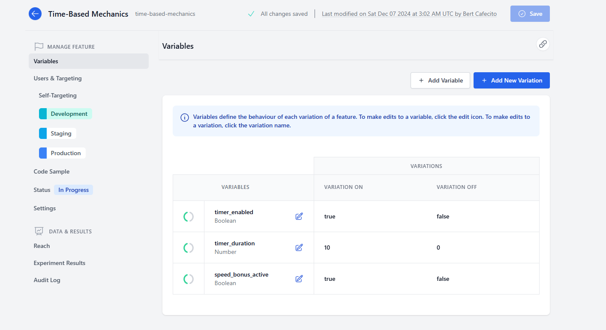

# DevCycle Feature Flag Challenge DEV Challenge

[DevCycle Feature Flag Challenge DEV Challenge][4] is a project about building an app that showcases the most unique, creative, or fun way to use feature flags in an application by leveraging a [DevCycle SDK][1], [OpenFeature Provider][2] or [the API][2]!

This project will not be maintained after the DEV Challenges is finished. Feel free to fork and maintain your own version.

[1]: https://docs.devcycle.com/sdk/
[2]: https://docs.devcycle.com/integrations/openfeature
[3]: https://docs.devcycle.com/management-api/
[4]: https://dev.to/challenges/devcycle

## What are DEV Challenges?

DEV Challenges are like miniature Hackathons, and provide a fun opportunity for you to build up experience using new tools or to publicly show off your best skills to the community, potential employers and more. You can find more information about DEV Challenges [here](https://dev.to/challenges).

## What I Built

The app that I built for this challenge is a Trivia Game that allows users to answer multiple-choice trivia questions. The app features a frontend using HTML, CSS, and JavaScript. The frontend provides an interactive interface for users to engage with the trivia questions.

### Features

- **Time-Based Mechanics**: Control the availability of timers, speed bonuses, and time-based challenges.
- **Scoring System**: Configure scoring logic for the trivia app, including streak bonuses and difficulty-based points.
- **Power-Ups**: Allow players to use tools like 50/50, hints, or skip functionality.
- **Progression System**: Manage levels, XP, achievements, and content unlocks.
- **Accessibility**: Manage user accessibility options.

## Live Demo

You can view the live demo of the app [here](https://bert-cafecito.github.io/devcycle-feature-flag-challenge/).

### Question Screen 

### Mechanics Screen

### Accessibility Screen

### Accessibility Feature

### Power-Ups Feature

### Progression System Feature

### Scoring System Feature

### Time-Based Mechanics Feature

## My DevCycle Experience

Integrating DevCycle into my application proved to be an insightful and valuable experience. Initially, understanding how to effectively leverage feature flags presented a challenge. Feature flags enable the activation or deactivation of specific features without requiring a code deployment—a powerful capability that necessitates a solid understanding of the system to fully utilize.

A key challenge was learning how to properly configure and manage features within the DevCycle platform. After several attempts, I developed a deeper understanding of how to create and control features. This process involved setting up feature variations to deliver a more dynamic and tailored user experience.

Additionally, I encountered the challenge of utilizing user targeting to personalize the user experience. I believe that leveraging user targeting could have significantly enhanced the interactivity and engagement of the trivia experience.

- **Feature Flag Evaluation:** By implementing targeting rules based on custom properties, I could have presented different feature variables based on the user’s progress in the trivia game.

- **Dynamic Adjustments:** Using feature flag values, I could have adjusted trivia question difficulty and time limits to create a personalized experience for each user. This would have made the app more engaging and challenging for users of varying skill levels.

- **User Accessibility Options:** A great idea I had at the last minute, but didn't implement, was managing user accessibility options via a feature flag. This would have allowed me to dynamically adjust accessibility features, such as font size, color contrast, or other visual adjustments, based on user preferences. This could greatly enhance the user experience for individuals with specific needs or preferences.

As a software engineer primarily focused on backend (server-side) development, I found that DevCycle is more tailored to frontend applications. However, I aimed to create the best static website possible that would leverage the advantages of DevCycle.

## Suggestions for Improving DevCycle

Based on my experience, here are a few suggestions for improving DevCycle:

- **Enhanced Documentation:** Providing more detailed documentation and examples for setting up and managing feature flags would help new users get up to speed more quickly.

- **SDK Key Permissions:** I would appreciate a section that explains how to configure client SDK key permissions. In reviewing the documentation, I found limited information on the permissions granted to SDK keys. For enterprise-level implementations, especially for CISOs, having clear details on SDK key permissions is essential.

- **Discord Community:** The DevCycle Discord community felt somewhat lackluster and could benefit from more engagement and resources. A more active and resourceful Discord channel would help users feel more connected and supported. If you’d like to reach out, feel free to connect with me through your Discord server..

By addressing these areas, DevCycle can further enhance its platform and provide an even better experience for its users.

## Support

If you would like to support this project or me, you can do so in the following ways:

### Follow Me on Social Media

- [**Bluesky**](https://bsky.app/profile/bert-cafecito.bsky.social)
- [**Dev Community**](https://dev.to/bert-cafecito)
- [**GitHub**](https://github.com/bert-cafecito)

### Star the Repository

If you find this project useful, please consider starring the repository on GitHub. Starring a repository helps increase its visibility and lets others know that the project is valuable. It also provides motivation and support to the maintainers to continue improving the project.

## License

This project is licensed under the MIT License. See the [LICENSE](LICENSE) file for details.